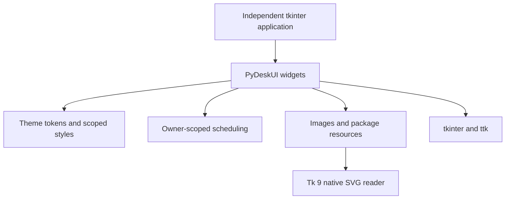

# Architecture and component ownership

> Revised design: 2026-09-04; source audit: 2026-09-03 · Source revision: `e8e28e8` · Architecture direction; current appearance and APIs are documented in [design system](design-system.md) and [public reference](reference.md).

## Design principles

A user should be able to replace a ttk widget with a PyDeskUI widget without adopting a new application framework. The library owns appearance and reusable interaction, while the application owns windows, domain state, data access and the event loop.

## Target package organization

| Module | Responsibility | Exclusions |
|---|---|---|
| `pydeskui.widgets` | Buttons, entries, search, collection/detail presentation, forms, progress, dialogs | Plugin discovery, installation or entitlement logic |
| `pydeskui.theme` | Tokens, per-interpreter contexts, named fonts, scoped ttk styles | Global modification of unrelated ttk styles |
| `pydeskui.resources` | Explicit asset loading, Tk image ownership and cache | Remote downloads, package management |
| `pydeskui.scheduling` | Cancellable `after` work tied to widget lifetime | A second async event loop or worker-pool framework |
| `pydeskui.i18n` | Explicit translation context for library-owned labels | Global gettext installation or translation of consumer business strings |

Only supported names are re-exported from `pydeskui`. Internal implementation modules remain private. Importing any supported module must not create a Tk root, open a network connection or start an event loop. Actual widget construction requires working Tk and a display.

## Original consumer scenarios

| PyDeskTools need | Reusable PyDeskUI primitive | Application-owned composition |
|---|---|---|
| Search installed tools | SearchEntry | Search/filter controller and command ranking |
| Show available plugins | ItemList and DetailView | PluginCard, trust/source labels and version actions |
| Configure a tool | Form and FieldSpec | Manifest-to-form mapping and command schema validation |
| Install or execute a tool | ProgressView, Button, Dialog | InstallJob, cancellation policy and task status |
| Show results/errors | DetailView and Dialog | Error diagnostics, logs and data export |
| Preview/crop a raster region | ImageView and ImageSelection | Screenshot capture, compressed-output comparison and save/copy actions |

`ItemList` is a reusable selection/list wrapper, initially backed by ttk.Treeview. It is not a new virtualized data-grid engine. `DetailView` provides plain text and readonly text/code blocks, not a browser or arbitrary HTML renderer. Business cards use composition instead of adding plugin-specific parameters to the UI library.

The current component set also includes structural containers, native inputs, data views and owned overlays. See the public reference for implemented names and contracts; ImageView and ImageSelection in the scenario table remain proposals.

## Ownership and lifetime

One application controls one main Tk interpreter; additional windows use Toplevel. Every widget belongs to its explicit parent and interpreter. A Theme context is also interpreter-scoped. Any library-generated StringVar or image receives the correct explicit master.

A widget tracks its own scheduled callbacks and variable traces. `destroy()` cancels callbacks, removes owned traces/bindings, drops its image references and then delegates to tkinter. It must not remove callbacks, variables, bindings or images owned by other widgets. Repeated cleanup is safe.

Keep scheduled work owner-scoped and respect reduced motion when adding motion. The current Skeleton is static; theme settings do not imply animation support in every component.

## Threading

Public GUI APIs execute on the Tk-owning thread. Background work returns data to a caller-owned queue; a callback scheduled on the Tk thread drains that queue. Do not call `after`, `StringVar.set`, widget methods or dialogs from a worker thread in the proposed programming model. This deliberately conservative contract avoids depending on platform-specific Tcl threading behavior. [Tkinter threading model](https://docs.python.org/3/library/tkinter.html#threading-model), accessed 2026-09-03.

## Dependency acceptance

Core runtime dependency count is zero beyond standard-library tkinter and Tcl/Tk 9.
Tk 8.6 is rejected explicitly. SVG is the packaged source format; Tk 9 converts
it to PhotoImage data at the requested DPI or size. High-volume frame and label
surfaces use lightweight ttk elements, while SVG image elements are limited to
icons, indicators and compact rounded controls.

Professional desktop appearance is library-owned: semantic tokens, scoped ttk
styles, native SVG assets and limited Canvas composition provide configurable
presentation while preserving native interaction contracts. Platform-native
appearance is not the priority for these surfaces; identical pixels across
operating systems are not guaranteed. See [ADR 0003](adr/0003-tk9-svg-rendering.md).
