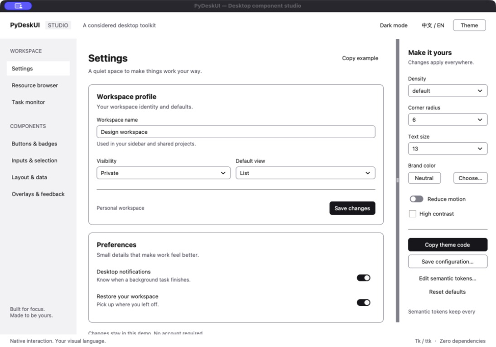
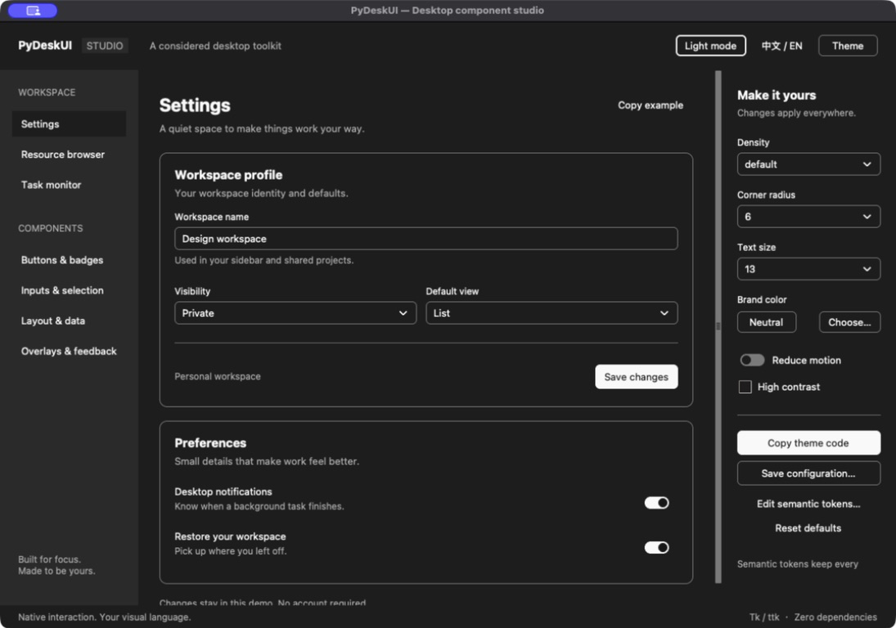

# Professional desktop design system

PyDeskUI combines semantic colors, scoped ttk styles and small Tk drawings for
professional desktop interfaces. The runtime uses the Python standard library
and Tcl/Tk, with zero third-party runtime dependencies. Applications retain their
own windows, event loop, variables, data and callbacks.

The [public reference](reference.md) describes implemented APIs. The
[appearance decision](adr/0002-professional-desktop-appearance.md) explains why
appearance is library-owned while native interaction contracts remain.

## Theme configuration

```python
import tkinter as tk
from pydeskui import Button, Card, Entry, Label, Theme

root = tk.Tk()
theme = Theme(root, mode="light", radius=6, density="default", font_size=13)
card = Card(root, theme=theme)
card.pack(fill="both", expand=True, padx=16, pady=16)
Label(card, text="Project name", theme=theme).pack(anchor="w")
name = tk.StringVar(master=root)
Entry(card, textvariable=name, placeholder="Untitled project", theme=theme).pack(fill="x")
Button(card, text="Dark mode", variant="secondary", theme=theme,
       command=lambda: theme.configure(mode="dark")).pack(anchor="e", pady=8)
root.mainloop()
```

Pass the same explicit theme to children that should share appearance. Omitting
`theme` resolves a root-owned default context; it does not inherit an arbitrary
parent widget's explicit theme. Contexts cannot cross Tcl interpreters.

| Setting | Values and default |
|---|---|
| `mode` | `light` (default), `dark`; explicit selection, no automatic OS detection. |
| `accent` | Tk color or `None` (default); sets primary/ring and sidebar primary branding. |
| `tokens` | Mapping of semantic color overrides; default none. |
| `radius` | Finite number 0–12 inclusive; default 6 logical pixels. |
| `density` | `compact`, `default` (default), `comfortable`. |
| `font_family` | Nonempty font family; defaults to the TkDefaultFont family. |
| `font_size` | Finite number 9–40 inclusive; default 13 logical pixels. |
| `contrast` | `normal` (default), `high`. |
| `reduced_motion` | Boolean, default `False`; does not add animation to static components. |
| `focus_ring` | `auto` (default), `always`, or `never`; auto shows focus only for keyboard navigation. |

Density drives button and entry spacing, tab height, table rows and table headings;
it is not a global layout manager. Logical dimensions use the current Tk scaling through `px()`;
the library does not change global Tk scaling. Explicit native dimensions and
padding remain caller-controlled, and native text widths remain character-based.
Card derives its radius from `Theme.radius`: 10 at the default 6, capped at 12.

## Semantic color tokens

Use Python underscore keys, not CSS hyphenated names. Values must be valid Tk
colors; unknown keys and invalid colors are rejected.

| Role | Keys |
|---|---|
| Application | `background`, `foreground` |
| Card | `card`, `card_foreground` |
| Popup | `popover`, `popover_foreground` |
| Primary action | `primary`, `primary_foreground` |
| Secondary action | `secondary`, `secondary_foreground` |
| Muted content | `muted`, `muted_foreground` |
| Highlight | `accent`, `accent_foreground` |
| Destructive action | `destructive`, `destructive_foreground` |
| Boundaries and focus | `border`, `input`, `ring` |
| Sidebar | `sidebar`, `sidebar_foreground`, `sidebar_primary`, `sidebar_primary_foreground`, `sidebar_accent`, `sidebar_accent_foreground`, `sidebar_border`, `sidebar_ring` |

The `accent=` constructor setting applies branding to several roles. The
`tokens={"accent": ...}` key changes the highlight role only. Not every component
uses every role; for example, Sidebar is a container, not a navigation controller.

Resolution order is mode palette, accent branding, high-contrast adjustments,
then explicit token overrides. High contrast sets border, input and muted text
to the foreground color before overrides. It does not validate arbitrary
foreground/background combinations or guarantee accessibility conformance.

```python
theme.configure(tokens={"primary": "#2457a7", "primary_foreground": "#ffffff"})
theme.configure(tokens={"ring": "#2457a7"})  # replaces the previous mapping
theme.configure(tokens={})                   # clears all token overrides
theme.configure(accent=None)                 # clears accent branding
settings = theme.export()                    # Python dict, not JSON text
copy = Theme(root, **settings)                # separate context, same interpreter
copy.close()                                # no widgets use this context
```

Omitting tokens, or passing `tokens=None`, preserves existing overrides.
`export()` includes appearance settings and a copy of explicit overrides, not
all resolved colors or the translator. Use `theme.tokens` to read the resolved
palette. Change settings with `configure()` so registered widgets refresh.
Destroy widgets using a theme before calling its `close()`.

## Components and interaction

The 38 components comprise eight existing controls/views, thirteen structural
components, eight additional inputs, and nine overlays/feedback components.
`Item` and `FieldSpec` are data helpers and are not included in that count.

Buttons offer `default`, `primary`, `secondary`, `outline`, `ghost`,
`destructive`, `link`, and `text` variants with small/medium/large sizes.
Entries expose placeholder and invalid-state presentation. Native input editing,
variables, widget methods and callback signatures remain part of the contract.
The custom Combobox popup commits through `<<ComboboxSelected>>`, while Table
reports sorting requests and leaves row ordering to the application.

Frames, cards, sidebars and toolbars host caller-supplied children. Tabs, trees
and split panes retain their ttk APIs. ScrollArea and popup/panel composites
expose `.content` as the child parent. Menu and overlay state belongs to the
creating widget; applications continue to own domain actions.

Select lists and menus render inside the owning application window so rounded
corners reveal the underlying application surface and window stacking cannot be
split by another process. Native popup and dialog windows inherit the active
Theme appearance. Toast feedback defaults to a three-item bottom-right in-window
stack, while explicit anchor or screen-coordinate placement remains available.

Tabs use a compact muted strip with rounded selected, hover and keyboard-focus
states. Tree disclosure indicators keep a larger text gutter and 20 logical-pixel
indent. Table headings are left-aligned by default with density-aware vertical
padding; callers may override native heading options.

Wheel input over Text, Treeview, Listbox and Canvas descendants stays with the
child while it can move in that direction. At a boundary, or when the child has
no overflow, the enclosing ScrollArea continues the gesture. Nested ScrollAreas
remain isolated from their ancestors, as do controls whose wheel changes a value.

## Boundaries and review

Tk 9 SVG-backed ttk elements supply compact rounded controls and indicators;
high-volume Frame and Label surfaces use lightweight scoped ttk elements.
Bundled icons are SVG sources rendered at the active scale. Canvas is limited to
composition such as static skeletons. Switch retains checkbutton interaction.
These choices do not promise identical pixels on every OS or replace Tk with a browser/CSS engine.

Keep visible labels for inputs and icon actions. Review focus, keyboard use,
contrast, scaling, popup placement and destruction in the target application.
The API descriptions are not a report of verified accessibility, full platform
support or screen-reader testing. The gallery demonstrates compositions; it is
not a certification suite. External SVG uses Tk 9's supported subset.

## Desktop workbench

The Gallery includes settings, resource browsing, and task-monitor scenes plus
component pages. Its theme panel edits density, radius, text size, branding,
contrast and reduced motion. “Edit semantic tokens…” opens a font-family and
color override editor. Apply validates all overrides before updating; blank fields
inherit defaults. Copy/save exports a Python configuration.

These are actual macOS Tk screenshots, not web mockups:





Aqua can ignore background settings on inherited elements. Core containers and
labels use opaque image surfaces; rounded controls use antialiased, matte corners
to avoid exposing the host's background. Native editing and focus bindings remain.
Built-in line icons are packaged at multiple resolutions for light/dark themes;
custom colors and sizes use the same standard-library rasterizer.
